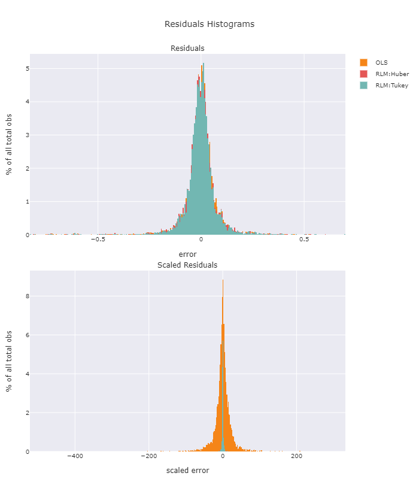

# FINM33150 - Robust Regression

## Dependencies

Create a virtual environment and install dependencies with

    pipenv install

This assignment compares the performance characteristics of three linear different linear models, an ordinarily least squares model and two robust linear model, one with a with Huber T penalty function and the other with a Tukey Biweight penalty function. We use a simple bivariate input comprised of the geometric average of the weekly "return" on 5-year CDS rates for a selection of 11 other public traded companies and the weekly return on adjusted closing price to predict weekly 5-year CDS return. In order to have a reasonable number of instances of each model type to analyze, we fit models for successive periods of 16 weeks beginning 2018-01-02 and ending 2020-12-16 (155 periods). We then analyze the residuals from predictions of the immediately following four weeks for each period.

### Analyses:
* Comparison of histograms of residuals and scaled residuals
* Comparison of summary statistics of residuals and scaled residuals
* Cumulative mean error by error quantile, scaled and unscaled
* Relative cumulative mean error by quantile
* Residual-residual plots

## Histograms

